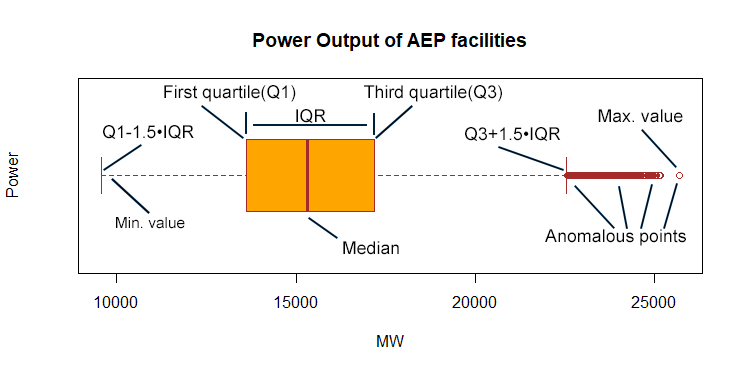
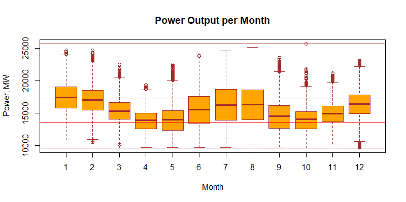
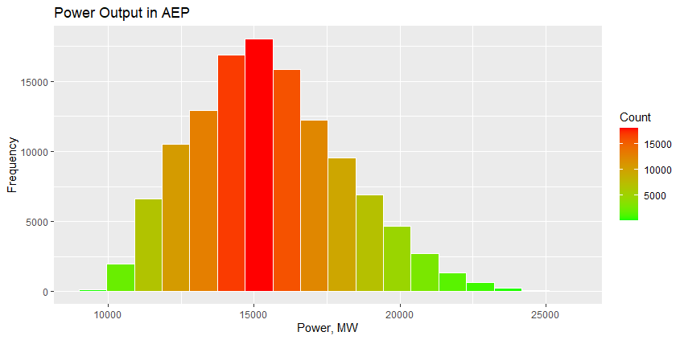
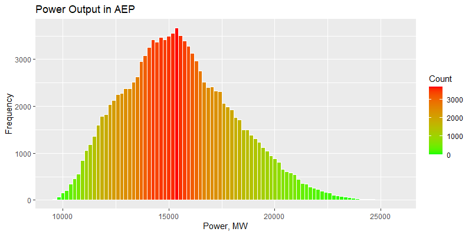
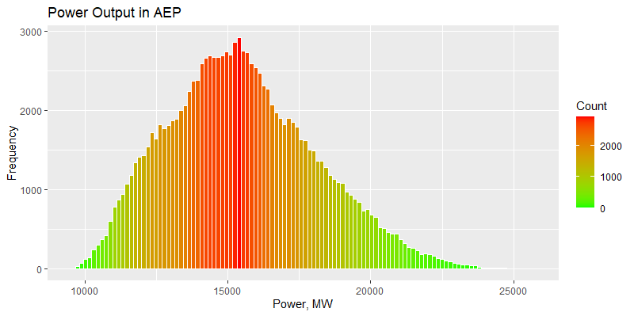
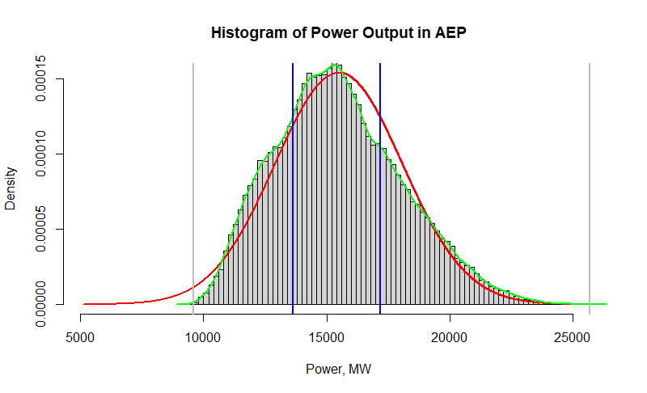
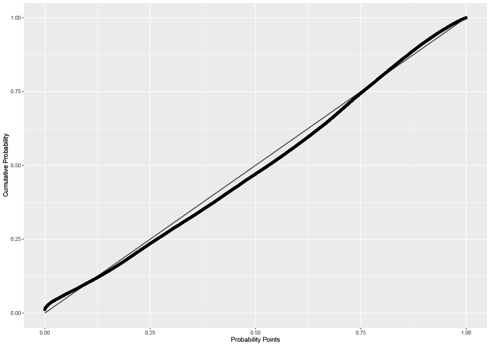
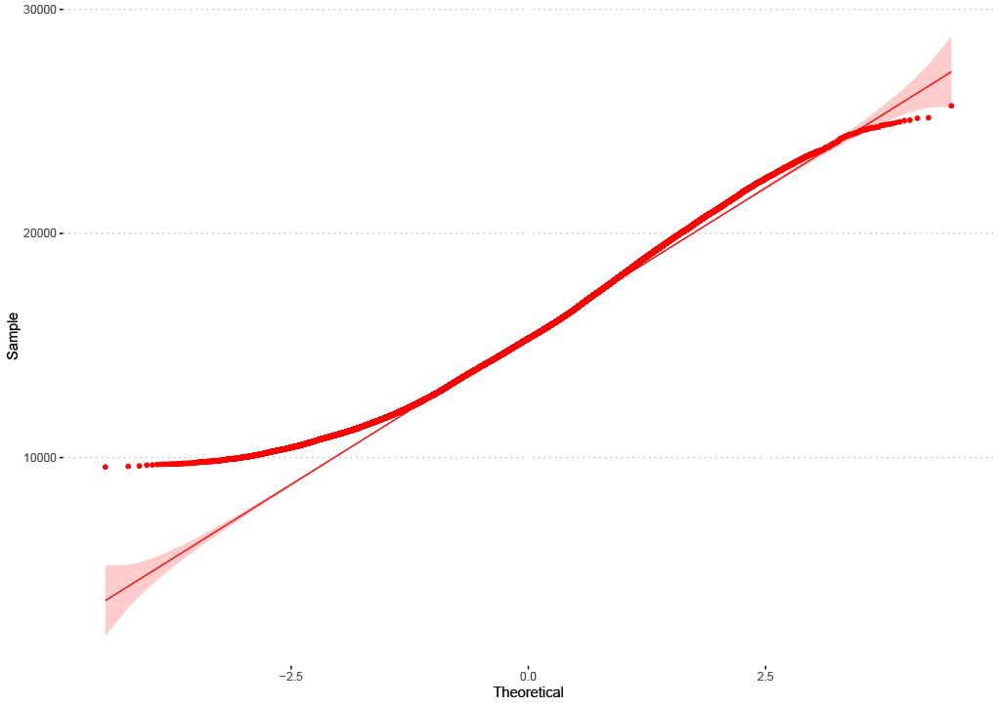

```{r setup, include=FALSE}
knitr::opts_chunk$set(echo = TRUE)
```

#  Data pre-processing. Descriptive statistics. Exploratory analysis
\
\

\
\

# Introduction
American Electric Power is a major investor-owned electric utility in the USA, delivering electricity to more than five million customers in 11 states.
The aim of this paper is to outline the most significant steps of numerical data analysis on the example of overall power output(in MW) of all the AEP's facilities. The paper focuses on the following aspects of research:

    1. Getting data ready and generalizing it
    2. Using visualization techniques to make an assumption on the distribution type
    3. Checking the assumption with one of the T-criteria methods
    
Time period to be analysed: 2004-12-31 01:00:00 - 2018-01-02 00:00:00 (14 years). Total amount of records: 121273. Data frame includes two columns:

    * Data
    * AEP_MW
    
```{r echo=FALSE}
AEP_Data <- read.csv("C:/Statistics_Labs/Lab1/AEP_hourly.csv")
energyData<-AEP_Data$AEP_MW
library(e1071)
```
# Data summary
```{r}
head(AEP_Data)
```
Note, that ***AEP_Data*** is a data frame, whereas ***energyData***(=AEP_Data$AEP_MW) is a column(vector) and contains numerical values.

## Quantiles, Mean, Variation range
```{r}
quantile(energyData)
mean(energyData)
range(energyData)
```
## Measures of spread
### Variance
```{r}
var(energyData)
```
### Standard deviation
Defined as a square root of variance.
```{r}
sd(energyData)
```
### Variation coefficient
```{r}
sd(energyData)/mean(energyData)*100
```
### Interquartile range
3rd minus 1st quartile value.
```{r}
IQR(energyData)
```
## Five-point characteristic
### Overall description
A box plot (or box-and-whisker plot) shows the distribution of quantitative data in a way that facilitates comparisons between variables.
```{r eval=FALSE}
boxplot(AEP_Data$AEP_MW,
        main="Power Output of AEP facilities",
        ylab="Power",
        xlab="MW",
        col = "orange",
        border = "brown",
        horizontal = TRUE,
        notch = FALSE)
```

\
A few observations from the figure:

    1. Minimal observed value of the researched random variable(RRV) is not anomalous, the maximal observed value however lies outside the "non-anomalous" range(and so does a plenty of other points).
    2. Since mean is larger than median, the skewness of the RRV is going to be positive.
### Boxplot monthly
```{r eval=FALSE}
d2_date = as.POSIXct(AEP_Data$Datetime , format = "%Y-%m-%d %H:%M:%S ")
AEP_Data$DATE = d2_date
month = lubridate::month(AEP_Data$DATE)
AEP_Data$Month = month

boxplot(AEP_Data$AEP_MW~Month, data=AEP_Data,
        main="Power Output per Month",
        ylab="Power, MW",
        col="orange",
        border="brown")
abline(h=quantile(energyData, c(0.25, 0.75)), col="red")
abline(h=range(energyData), col="brown")
```

\
The top- and bottom brown lines outline variation range. The two red lines in the lower part of the plot mark the 1st and 3rd quartiles.
In December, February, and March anomalous observations of RRV appear below the $Q_{1}-1.5IQR$ point. The majority of anomalies though is above the $Q_{3}+IQR$ point.

## First and Ninth Decile
```{r}
quantile(energyData, prob = c(0.1, 0.9))
```
## Skewness and Excess kurtosis coefficient
The first is a measure of asymmetry of the probability distribution about its mean.\
+ $\to$ tail to the left, - $\to$ to the right, 0 $\to$ balance.\
The latter measures the "fatness" of the tails of distribution. \
+ $\to$ peak is plain, - $\to$ peak is sharp, 0 $\to$ $\gamma_{2}(X \sim {\sf Norm}(0, 1)) = 0$.\
```{r}
skewness(energyData)
kurtosis(energyData)
```
The results might be visually observed in the next section.

# Grouped histograms

## Sturges' formula
The ***number of bins*** is calculated as following:

$$
\begin{aligned}\large
k = [\log_{2}(n)] + 1 
\end{aligned}
$$

where $[x]$ is the ceiling function.\
```{r eval=FALSE}
buildFreq<-function(binsCount){
  ggplot(AEP_Data,aes(x=AEP_MW))+
    geom_histogram(bins=binsCount, color="white",
        aes(fill=..count..))+
    scale_x_continuous("Power, MW")+
    scale_y_continuous("Frequency")+
    scale_fill_gradient("Count", low="green", high="red")+
    labs(title = "Power Output in AEP")
}
k=nclass.Sturges(energyData)
buildFreq(k)
```


## Scott's normal reference rule
The ***bin width*** is calculated using the formula:

$$
\begin{aligned} \large 
h = \frac{3.49\hat{\sigma}}{n^{1/3}}
\end{aligned}
$$

where $\hat{\sigma}$ is the sample standard deviation.\
Though the above formula calculates the width of the bins, the return value of 
```{r eval=FALSE}
nclass.scott(energyData)
```
method is the number of bins, calculated as follows:

$$
\begin{aligned}\large
k = [\frac{\max(x) - \min(x)}{h}]
\end{aligned}
$$

The braces indicate the ceiling function.
```{r eval=FALSE}
s=nclass.scott(energyData)
buildFreq(s)
```



## Freedman-Diaconis' choice
Defined as:

$$
\begin{aligned}\large
h = 2\frac{IQR(x)}{n^{1/3}}
\end{aligned}
$$

IQR denotes the interquartile range.
```{r eval=FALSE}
fd=nclass.FD(energyData)
buildFreq(fd)
```


# Probability density function(PDF) and its kernel estimation
The kernel density estimation(KDE) is calculated as:

$$
\begin{aligned}\large
\hat{f}(x)=K\frac{\sum_{i=1}^{n}(x-x_{i})}{h}
\end{aligned}
$$

\
where $K>0$ is a kernel function, and $h$ is a bandwidth.
KDE does not depend on the parameters of the RRV. Nevertheless the shape of the KDE curve is defined by width of bins $h$.
The red curve in the following plots is the PDF of the random variable which is hypothetically distributed as $N\sim(\mu;\sigma^2)$, where $\mu$ is mean and $\sigma^2$ is variance. The green curve displays the KDE function. The blue lines are 1st and 3rd quartiles and the gray ones are minimum and maximum values of the observable range.
```{r eval=FALSE}
hist_and_norm <- function(energyData){
  hist_min <- mean(energyData) - 4*sd(energyData)
  hist_max <- mean(energyData) + 4*sd(energyData)
  normalx <- seq(hist_min, hist_max, by = 1)
  normaly <- dnorm(normalx, mean = mean(energyData), sd = sd(energyData))
  hist(data, 
       main = "Histogram of Power Output in AEP",
       xlab = "Power, MW",
       xlim = c(hist_min, hist_max),
       ylim =c(0, max(normaly)),
       breaks = nclass.Sturges(energyData),
       #alternatively .scott(energyData)
       freq = FALSE)
  lines(normalx, normaly, col = "red", lwd="2")
  lines(density(energyData), col="green", lwd="2")
  abline(v=quantile(AEP_Data$AEP_MW, c(0.25, 0.75)), col="blue", lwd="2")
  abline(v=range(energyData), col="grey", lwd="2")
}
hist_and_norm(AEP_hourly$AEP_MW)
```
## Sturges'numbers of bins


## Scott's number of bins


# Hypothesis proof
Two core visualization techniques should be taken into consideration before using a hypothesis proof criterion.
P-P plots are used assess the agreement of the two cumulative distribution functions(CDFs) - empirical and theoretical. 
Q-Q plots allow us to compare CDFs by plotting their quantiles against each other.

## P-P plot
Why use P-P plots?

    1. They are well suited to compare regions of high probability density (center of distribution) because in these regions the empirical and theoretical CDFs change more rapidly than in regions of low probability density.
    2. P-P plots can be used to visually evaluate the skewness of a distribution
    3. The plot may result in weird patterns (e.g. following the axes of the chart) when the distributions are not overlapping. So P-P plots are most useful when comparing probability distributions that have a nearby or equal location.
    
The following listing uses extremely resource-demanding method
```{r eval=FALSE}
stat_pp_band()
```
for drawing P-P confidence bands. For this reason large data sets may overwhelm the computational machine's capability unless it is powerful enough to manage this. For instance 4GB of DDR was not enough to place more than 925 MB of data to complete the computation in decent time. That is why they they may not be seen in the plot.

```{r eval=FALSE}
buildPPplot<-function(){
  m <- mean(AEP_Data$AEP_MW)
  s <- sd(AEP_Data$AEP_MW)
  dp <- list(mean = m, sd = s)
  gg <- ggplot(data = AEP_Data, mapping = aes(sample = AEP_MW)) +
    stat_pp_band(distribution = "norm", dparams = dp) +
    qqplotr::stat_pp_line() +
    stat_pp_point(dparams = dp) +
    labs(x = "Probability Points", y = "Cumulative Probability")
  gg
}
```


Assume the variation range

$$
\begin{aligned}\large
x_{(0)} < x_{(1)}< ... < x_{(n)}
\end{aligned}
$$

\
is given.
Then the empirical CDF $\large \hat{F}_{n}$ will be defined as:

$$
\begin{aligned}\large
\hat{F}_{n}(x_{i} = i/n)
\end{aligned}
$$
\
And the P-P plot is therefore built by points with coordinates

$$
\begin{aligned}\large
(F_{\xi_{0}}(x_{i}), i/n)
\end{aligned}
$$
\
Hence the points on the y-axis are "fixed", whereas and the theoretical CDF of the RRV then takes the observable values from the variation range as an argument.
Such a comparison gives insight into how different the two CDFs are by measuring "skewness" of the theoretical CDF with respect to the empirical one in every point of the variation range.

## Q-Q plot
A few points on Q-Q plots:

    1. Interpretation of the points on the plot: a point on the chart corresponds to a certain quantile coming from both distributions (again in most cases empirical and theoretical).
    2. Q-Q plots do not require specifying the location and scale parameters of the theoretical distribution, because the theoretical quantiles are computed from a standard distribution within the specified family.
    3. They can be used to visually evaluate the similarity of location, scale, and skewness of the two distributions.
    
This line of code is not as resource-violent as the previous one and yet it takes more time to build the Q-Q plot than a histogram.
```{r eval=FALSE}
ggqqplot(AEP_Data, x="AEP_MW", color = "red", ggtheme = theme_pubclean())
```


Expression

$$
\begin{aligned}\large
F_{\xi_{0}}^{-1}(\hat{F}_{n}(x_{(i)}))
\end{aligned}
$$
\
defines the position of theoretical quantiles on the x-axis and takes empirical quantiles as argument, which are situated on the y-axis respectively. The plot above implies that there are a lot more empirical quantiles than the theoretical ones in range $[9581;\sim12000]$. For this reason the curve is somewhat flat in that range comparing to the 

$$
\begin{aligned}\large
y=sx+a
\end{aligned}
$$

\
line where $a$ and $s$ are unknown parameters.
The rest of the variation range quantiles lie quite close to the theoretical CDF line, so the quantiles are almost "normal" in this case.
The deviance residuals represent the contributions of individual samples to the deviance.

## Pearson's chi-squared test

Person's criterion is reasonable for large data sets and checks exactly the correlation with the normal distribution.
```{r}
library(nortest)
pearson.test(energyData)
```
However it does not seem to be fair in case of the AEP dataset. The p-value is extremely low, which is because of:

    1. The initial hypothesis is wrong.
    OR
    2. The p-value estimation failed due to large accumulated amount of minor elements which severely affected the result.

# Conclusion

Visual data implies that the RRV is normally distributed and moreover with high correlation rate. Nevertheless Pearson's chi-squared test does not provide definite answer on whether the initial distribution hypothesis is correct or not. Further analysis is therefore necessary to make any objective conclusions.